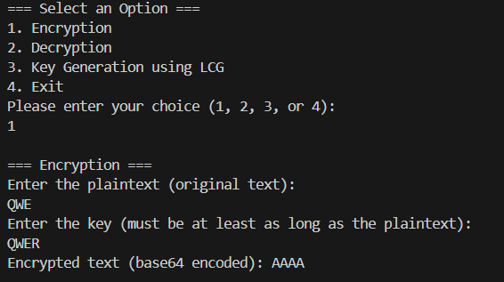
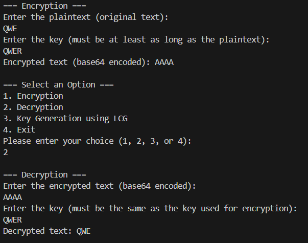
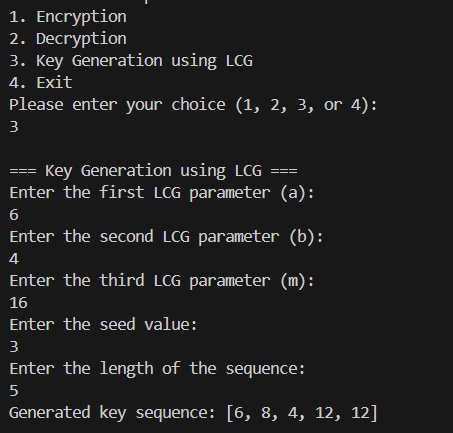

---
# Front matter
lang: ru-RU
title: "ЛАБОРАТОРНАЯ РАБОТА №3"
subtitle: "Дисциплина: Математические основы защиты информации и информационной безопасности"
author: "Дабван Луаи Мохаммед Али"

# Formatting
toc-title: "Содержание"
toc: true # Table of contents
toc_depth: 2
lof: true # Список рисунков
lot: true # Список таблиц
fontsize: 12pt
linestretch: 1.5
papersize: a4paper
documentclass: scrreprt
polyglossia-lang: russian
polyglossia-otherlangs: english
mainfont: Liberation Serif
romanfont: Liberation Serif
sansfont: Liberation Sans
monofont: Liberation Mono
mainfontoptions: Ligatures=TeX
romanfontoptions: Ligatures=TeX
sansfontoptions: Ligatures=TeX,Scale=MatchLowercase
monofontoptions: Scale=MatchLowercase
indent: true
pdf-engine: lualatex
header-includes:


  - \linepenalty=10
  - \interlinepenalty=0
  - \hyphenpenalty=50
  - \exhyphenpenalty=50
  - \binoppenalty=700
  - \relpenalty=500
  - \clubpenalty=150
  - \widowpenalty=150
  - \displaywidowpenalty=50
  - \brokenpenalty=100
  - \predisplaypenalty=10000
  - \postdisplaypenalty=0
  - \floatingpenalty = 20000
  - \raggedbottom
  - \usepackage{float}
  - \floatplacement{figure}{H}
---

# Цель работы

Изучить методы шифрования гаммированием.

# Задание

1. Программно реализовать шифрование с помощью XOR.
2. Программно реализовать расшифровку с помощью XOR.
3. Программно реализовать генерацию ключей с использованием линейного конгруэнтного генератора (LCG).

# Выполнение лабораторной работы

1) Все шифрования были выполнены на языке программирования Julia. Первым шагом была разработка функции xor_encrypt, которая реализует побитовую операцию XOR между символами исходного текста и ключа. Примечательно, что для расшифровки используется та же функция, поскольку операция XOR является обратимой, то есть повторное применение XOR с тем же ключом возвращает исходный текст.

### Реализация функции шифрования XOR

```julia
function xor_encrypt(plaintext::String, key::String)
    if length(key) < length(plaintext)
        error("The key must be longer than the plaintext.")
    end
    encrypted = [Char(xor(codeunit(plaintext, i), codeunit(key, i)))
    for i in 1:length(plaintext)]
    return join(encrypted)
end
```

### Тестирование шифрования и расшифровки

#### Шаг 1: Шифрование

**Пример 1:**

```plaintext
Текст для шифрования: QWER
Ключ для шифрования: ASDFG
```

```plaintext
Зашифрованный текст: EAQBFA
```



#### Шаг 2: Расшифровка

**Пример 2:**

```plaintext
Зашифрованный текст: EAQBFA
Ключ для расшифровки: ASDFG
```

```plaintext
Расшифрованный текст: QWER
```



2) Следующим шагом была реализация генерации ключей с использованием линейного конгруэнтного генератора (LCG). Для этого была разработана функция lcg, которая создает последовательность псевдослучайных чисел, используя параметры a,b,𝑚 и начальное значение seed. Эта последовательность затем используется в качестве ключей для шифрования..

### Реализация LCG

```julia
function lcg(a, b, m, seed, sequence_length)
    random_sequence = Int[]
    yi = seed
    for i in 1:sequence_length
        yi = (a * yi + b) % m
        push!(random_sequence, yi)
    end
    return random_sequence
end
```

### Тестирование генерации ключей

**Пример 3:**

```plaintext
Параметры LCG: a = 5, b = 3, m = 16, seed = 7, длина = 6
Сгенерированная последовательность: [6, 1, 8, 11, 10, 5]
```



5) Для удобства пользователя был создан интерактивный интерфейс с меню, позволяющим выбрать операцию: шифрование, расшифровка или генерация ключа.

# Выводы

Я успешно разработал систему шифрования с применением операции XOR и генерацией ключей на основе линейного конгруэнтного генератора (LCG). Все функции были протестированы с использованием примеров на английском языке. Результаты тестов показали, что шифрование и расшифровка выполняются правильно, а также что генерация ключей дает ожидаемые результаты.